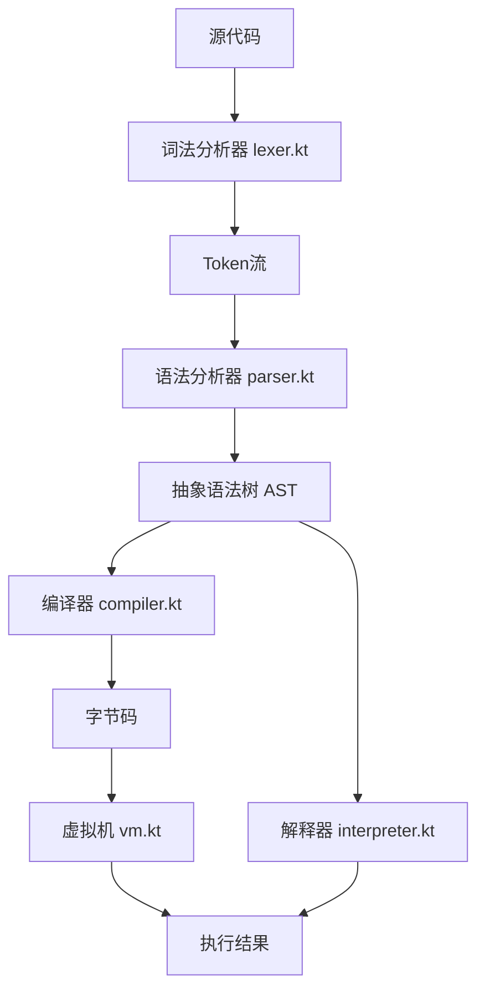

# MaidLang 编译器与虚拟机架构设计

## 概述
在现有解释器基础上，新增一套编译器（Compiler）与虚拟机（VM）执行引擎，将 MaidLang 源代码编译为字节码，再由栈式虚拟机解释执行，旨在提高执行性能并实现更底层的优化可能。

## 设计原则
- **与现有解释器共存**：不破坏现有解释器功能，提供新的执行路径。
- **基于栈的虚拟机**：采用操作数栈模型，指令简洁，易于实现。
- **复用现有类型系统**：继续使用 `MaidValue` 作为运行时值表示，`Type` 用于静态类型记录。
- **渐进式实现**：先实现核心指令，再逐步扩展功能。

## 系统架构



## 组件详述

### 1. 字节码指令集设计
采用变长指令格式，每条指令由操作码（Opcode）和可选的操作数组成。操作数可能是常量池索引、局部变量槽索引或跳转偏移量。

#### 指令枚举（Opcode.kt）
```kotlin
enum class Opcode {
    // 常量加载
    LOAD_INT,      // 操作数：常量池索引（int）
    LOAD_FLOAT,
    LOAD_STRING,
    LOAD_CHAR,
    LOAD_NULL,
    LOAD_TRUE,
    LOAD_FALSE,
    
    // 变量存取
    LOAD_VAR,      // 操作数：局部变量槽索引（int）
    STORE_VAR,
    
    // 二元运算（栈顶 two 个操作数）
    ADD, SUB, MUL, DIV, MOD,
    GREATER, LESS, GREATER_EQUAL, LESS_EQUAL,
    EQUAL, NOT_EQUAL,
    LOGICAL_AND, LOGICAL_OR,
    BIT_AND, BIT_OR, BIT_XOR,
    
    // 一元运算
    NEGATE, NOT,
    
    // 控制流
    JUMP,          // 无条件跳转，操作数：偏移量（int）
    JUMP_IF_TRUE,  // 条件跳转，栈顶值为真时跳转
    JUMP_IF_FALSE,
    
    // 函数调用
    CALL,          // 操作数：参数个数（int）
    RETURN,
    
    // 作用域管理
    ENTER_SCOPE,
    EXIT_SCOPE,
    
    // 数组/代理（暂未实现）
    LOAD_INDEX,
    STORE_INDEX
}
```

#### 常量池（ConstantPool）
存储字面量常量（整数、浮点数、字符串等），通过索引引用。

#### 局部变量槽
每个作用域内变量按声明顺序分配槽位索引。全局变量使用特殊槽位。

### 2. 编译器（compiler.kt）
将 AST 转换为字节码指令序列，同时构建常量池和局部变量映射。

**主要类**：
- `Compiler`：主编译类，持有常量池、局部变量表、当前作用域深度等状态。
- `CompilationContext`：编译上下文，记录当前函数、循环等控制流信息。

**编译策略**：
- **表达式**：生成将值压栈的指令。
- **语句**：生成执行副作用但不留值的指令（可弹出栈顶值）。
- **变量声明**：分配局部变量槽，生成 `STORE_VAR` 指令。
- **控制流**：使用标签和跳转指令实现 `if`、`while`。
- **函数定义**：将函数体编译为独立的字节码块，存储于函数表中。

### 3. 虚拟机（vm.kt）
解释执行字节码，管理运行时栈、调用帧和全局状态。

**主要类**：
- `VM`：虚拟机实例，持有全局状态、调用栈、指令指针。
- `Frame`：调用帧，包含局部变量数组、操作数栈、返回地址。
- `RuntimeValue`：沿用 `MaidValue`，作为栈元素和变量值。

**执行循环**：
```
while (ip < code.size) {
    val op = code[ip++]
    when (op) {
        LOAD_INT -> push(constantPool[readInt()])
        ADD -> {
            val b = pop()
            val a = pop()
            push(a + b)
        }
        ...
    }
}
```

### 4. 与现有解释器的关系
- **共享前端**：lexer 和 parser 保持不变，生成同一套 AST。
- **共享类型系统**：parser 中记录的 `nameTable` 和 `funcDefine` 可供编译器进行类型检查（未来）。
- **独立后端**：解释器直接遍历 AST 执行；编译器将 AST 编译为字节码后由 VM 执行。
- **测试兼容**：tester.kt 可扩展为同时运行两种后端，比较结果。

## 实施路线图

### 阶段 1：基础指令集与虚拟机
1. 创建 `bytecode.kt` 定义 `Opcode`、`ConstantPool`、`BytecodeChunk`。
2. 实现 `vm.kt` 核心循环，支持常量加载、算术运算、栈操作。
3. 实现 `compiler.kt` 对字面量、变量存取、二元运算的编译。
4. 集成到 `tester.kt`，添加编译执行模式。

### 阶段 2：控制流与函数
1. 实现 `JUMP` 系列指令，支持条件跳转。
2. 编译 `if`、`while` 语句。
3. 实现 `CALL`、`RETURN` 指令，支持函数调用。
4. 编译函数定义，处理参数和局部作用域。

### 阶段 3：优化与调试
1. 添加字节码反汇编器，便于调试。
2. 优化常量池和局部变量访问。
3. 实现简单的静态类型检查（可选）。

## 文件结构
```
.
├── lexer.kt
├── parser.kt
├── interpreter.kt          # 原有解释器
├── bytecode.kt            # 字节码相关定义
├── compiler.kt            # 编译器
├── vm.kt                  # 虚拟机
├── tester.kt              # 扩展测试套件
└── docs.md                # 更新文档
```

## 待决策问题
1. **字节码是否带类型信息**：当前设计为动态类型，所有值包装为 `MaidValue`。若未来需要静态类型优化，可增加类型特化指令（如 `ADD_INT`、`ADD_FLOAT`）。
2. **局部变量寻址方式**：采用槽位索引（编译时确定）还是名称哈希（运行时查找）。建议先使用槽位索引提升性能。
3. **错误处理**：沿用解释器的异常机制，或设计专门的虚拟机 trap 指令。

## 后续任务
完成本架构设计后，切换到代码模式逐步实现各阶段。每个阶段均需更新测试套件确保功能正确性。